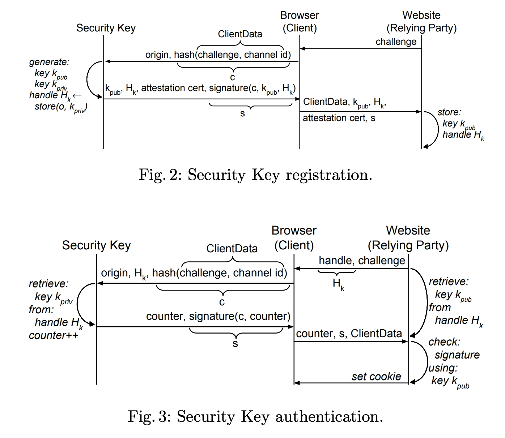

# u2f

u2f dongle implementation for MIT's 6.858 - Spring 2022

## Project Structure

- `arduino/`: arduino code that is uploaded to the actual dongle
  - receive -> origin, hash(challenge, challenge_id)
  - send -> certificate et al.
- `server/`: test server in python
  - receive ->
  - send ->
- `chrome/`: js that established a connection between the dongle and chrome via usb protocol
- `google-u2f-ref-code`: git submodule of google's u2f reference code

## Implementation



## Getting Started
To set up the submodule, run:
```
git submodule init
git submodule update --init --recursive
```

## arduino notes

Need to upgrade USB version to 2.1 by modifying `#define USB_VERSION 0x200` to `#define USB_VERSION 0x210` in `/Applications/Arduino.app/Contents/Java/hardware/arduino/avr/cores/arduino/USBCore.h`.

Then copy the `library/WebUSB` folder ([webusb/arduino](https://github.com/webusb/arduino)) into your Arduino libraries folder.

Right now, we only have it running on the Feather Bluefruit 32u4.

Our other options are:
- Install TinyUSB from a package manager.
- MIDIUSB or some other MIDI interface that feeds into chrome.

`about://device-log`: see all USB device related events

`about://usb-internals`: simulate connection and disconnection of virtual WebUSB devices

Test pages:
- https://webauthn.bin.coffee/  
- https://demo.yubico.com/webauthn-technical/registration
- https://akisec.com/demo/
- https://webauthn.io/

might need to use `mEcc` package (https://github.com/kmackay/micro-ecc) for `ECDH` and `ECDSA`.

## References

[1] J. Lang, A. Czeskis, D. Balfanz, M. Schilder, and S. Srinivas, “Security Keys: Practical Cryptographic Second Factors for the Modern Web,” in Financial Cryptography and Data Security, vol. 9603, J. Grossklags and B. Preneel, Eds. Berlin, Heidelberg: Springer Berlin Heidelberg, 2017, pp. 422–440. doi: 10.1007/978-3-662-54970-4_25. Available: https://css.csail.mit.edu/6.858/2022/readings/u2f-fc.pdf

[2] Reference code for U2F specifications. Google, 2022. Accessed: Apr. 02, 2022. [Online]. Available: https://github.com/google/u2f-ref-code

[3] [Google webauthn demo](https://docs.google.com/document/d/1-_zXFtWkRYx2XOF4xijzzV4cAvrsmwzrACuTsANheX8/edit#heading=h.y6jpxdlc0l4q)

## Other potentially helpful links

### Interfacing with USB through the web

- List of vendor usb id's: http://www.linux-usb.org/usb.ids
  - `0x2341` for Arduino
  - `0x16c0` for Teensyduino
- USB spec device descriptors: https://www.beyondlogic.org/usbnutshell/usb5.shtml#DeviceDescriptors
- WebUSB API: https://wicg.github.io/webusb/
- WebUSB arduino (useful to allow communication with arduino): https://github.com/webusb/arduino
- Access USB Devices on the Web: https://web.dev/usb/
