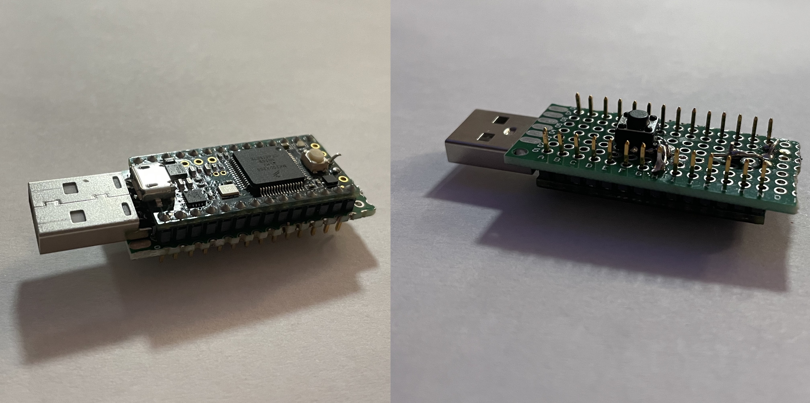
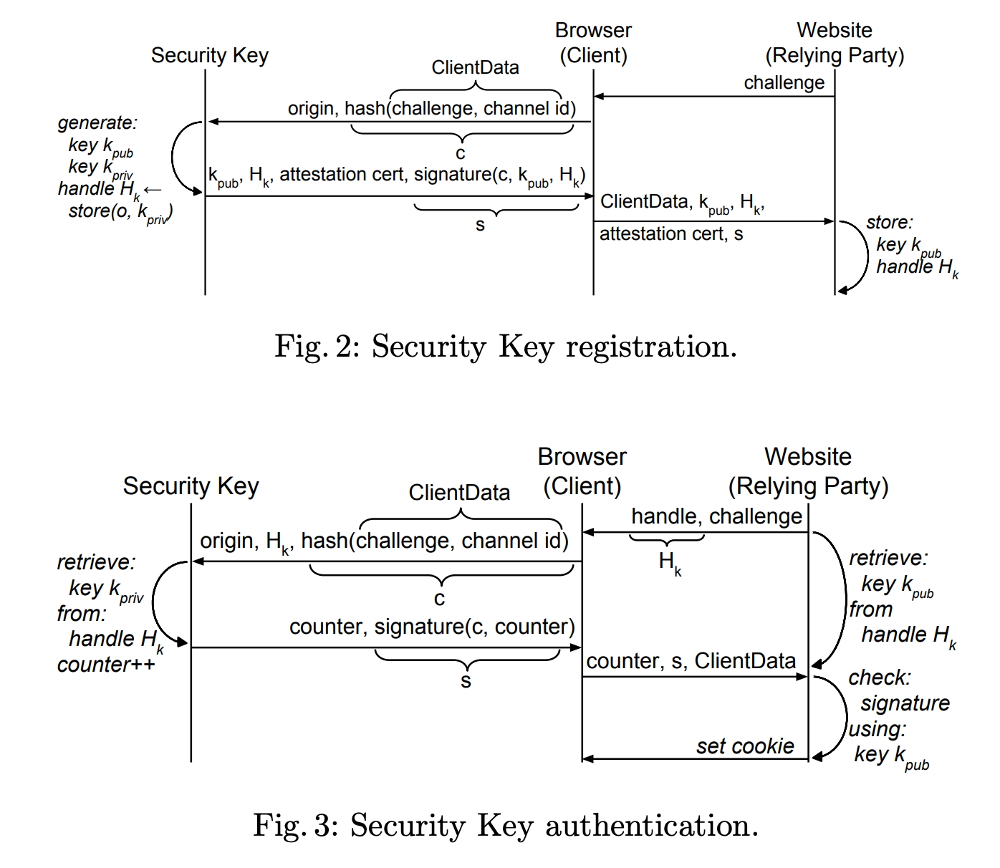

# FIDO 2 U2F Protocol

U2F dongle implementation created for and tested on a teensy 3.2 with the addition of a button.



## Project Structure

- [`microcontroller/`](microcontroller): teensy code that is uploaded
  - [`main/`](microcontroller/main): our implementation
  - [`crypto/`](microcontroller/crypto): AES128 implmentation from [crypto](https://github.com/OperatorFoundation/Crypto/tree/master/src)
  - [`sha256/`](microcontroller/sha256): sha256 implementation from [crypto-algorithms](https://github.com/B-Con/crypto-algorithms).
  - [`uECC/`](microcontroller/uECC): ECDH and ECDSA implementation for 8-bit, 32-bit, and 64-bit processors. See [micro-ecc](https://github.com/kmackay/micro-ecc).
- [`webauthn-website/`](webauthn-website): test webauthn capable server in python
- [`helpers/`](helpers): helper script for cert gen and usage page and usage id setup
- [`docs/`](docs): contains a write-up explaining the implementation and any photos used
- [`google-u2f-ref-code/`](google-u2f-ref-code): git submodule of google's u2f reference code

### Microcontroller Directory

- [`buffers.h`](microcontroller/main/buffers.h):
Data buffers used to recieve and send data

- [`button.h`](microcontroller/main/button.h):
Code for user presence confirmation with button

- [`channels.h`](microcontroller/main/channel_manager.h):
Definitions that help with channel management

- [`channels.h`](microcontroller/main/channels.h):
Structs and definitions for channels

- [`communication.h`](microcontroller/main/communication.h):
Main module that controls HID communication between microcontroller and browser.

- [`counter.h`](microcontroller/main/counter.h):
EEPROM counter code

- [`debug.h`](microcontroller/main/debug.h):
Macros that help debugging

- [`encryption.h`](microcontroller/main/encryption.h):
Main setup for encryption libs and RNG functions

- [`error_handling.h`](microcontroller/main/error_handling.h):
Communicating errors within the u2f and sw implementations

- [`keys.h`](microcontroller/main/keys.h):
Key storage. Ideally this would live on a secure element

- [`main.ino`](microcontroller/main/main.ino):
Run at start up. Manage and respond to HID communication

- [`message_processing.h`](microcontroller/main/message_processing.h):
Message processing for u2f and sw protocols

- [`packets.h`](microcontroller/main/packets.h):
Main packet manager that follows u2f spec on packets

- [`protocol_helpers.h`](microcontroller/main/protocol_helpers.h):
Helpers for `protocol.h`

- [`protocol.h`](microcontroller/main/protocol.h):
U2F protocol implementation

- [`test.h`](microcontroller/main/test.h):
Test functions for encrypt and decrypt


## Implementation



For communication protocol, look at [4], [5], [6].

- https://fidoalliance.org/specs/fido-u2f-v1.2-ps-20170411/fido-u2f-raw-message-formats-v1.2-ps-20170411.html#registration-request-message---u2f_register
- https://fidoalliance.org/specs/u2f-specs-master/fido-u2f-hid-protocol.html#:~:text=With%20a%20packet%20size%20of,%2D%205)%20%3D%207609%20bytes
- https://fidoalliance.org/specs/fido-v2.0-id-20180227/fido-client-to-authenticator-protocol-v2.0-id-20180227.html

## Microcontroller

Our current implementation is developed and tested on the Teensy 3.2. The hardware limitations
are requiring RawHID and EEPROM/persistent storage.

Advised to upgrade USB version to 2.1 by modifying `#define USB_VERSION 0x200` to `#define USB_VERSION 0x210` in 
`/Applications/Arduino.app/Contents/Java/hardware/arduino/avr/cores/arduino/USBCore.h`.

We use RawHID to communicate. Run the [helpers/setup_hid_iface.sh](helpers/setup_hid_iface.sh)
[Teensyduino location]
to setup the teensyduino core lib USB headers. The section `USB_RAWHID` in
 `Teensyduino.app/Contents/Java/hardware/teensy/avr/cores/teensy3/usb_desc.h`
 should redefine the following:
 ```C
  #define RAWHID_USAGE_PAGE  0xf1d0
  #define RAWHID_USAGE  0x01
  ```
You can reference
[helpers/teensy3_core_usb_desc.h](helpers/teensy3_core_usb_desc.h) to see what it should look like.

We use a button in pull down configuration on pin `19` on a teensy 3.2, this can be changed in `microcontroller/main/button.h`.

### Useful for debugging hardware connected to chrome

Chrome pages:

`about://device-log`: see all USB device related events

`about://usb-internals`: simulate connection and disconnection of virtual WebUSB devices

# Debugging U2F

The test webauthn website in this repository lives at https://u2f-858.herokuapp.com/

Other useful testing websites here:
- https://webauthn.bin.coffee/  
- https://demo.yubico.com/webauthn-technical/registration
- https://akisec.com/demo/
- https://webauthn.io/

### Resources used for hardware definitions

- List of vendor usb id's: http://www.linux-usb.org/usb.ids
  - `0x2341` for Arduino
  - `0x16c0` for Teensyduino
- USB spec device descriptors: https://www.beyondlogic.org/usbnutshell/usb5.shtml#DeviceDescriptors
- WebUSB API: https://wicg.github.io/webusb/
- WebUSB arduino (useful to allow communication with arduino): https://github.com/webusb/arduino
- Access USB Devices on the Web: https://web.dev/usb/
- uECC doc: https://github.com/kmackay/micro-ecc/blob/master/examples/ecc_test/ecc_test.ino
- Message headers: https://fidoalliance.org/specs/fido-u2f-v1.2-ps-20170411/inc/u2f.h
- SW Command status responses: [ISO-7816]()

## Website Notes!

A website is setup to use webauthn at https://u2f-858.herokuapp.com/
To run [`webauthn-website`](webauthn-website) locally, follow intructions in [`webauthn-website/README.md`](webauthn-website/README.md)

## Setting up google-u2f-ref-code submodule
To set up the submodule, run:
```
git submodule init
git submodule update --init --recursive
```

## References

[1] J. Lang, A. Czeskis, D. Balfanz, M. Schilder, and S. Srinivas, “Security Keys: Practical Cryptographic Second Factors for the Modern Web,” in Financial Cryptography and Data Security, vol. 9603, J. Grossklags and B. Preneel, Eds. Berlin, Heidelberg: Springer Berlin Heidelberg, 2017, pp. 422–440. doi: 10.1007/978-3-662-54970-4_25. Available: https://css.csail.mit.edu/6.858/2022/readings/u2f-fc.pdf

[2] Reference code for U2F specifications. Google, 2022. Accessed: Apr. 02, 2022. [Online]. Available: https://github.com/google/u2f-ref-code

[3] https://github.com/tonijukica/webauthn.git

[4] https://fidoalliance.org/specs/fido-u2f-v1.2-ps-20170411/fido-u2f-raw-message-formats-v1.2-ps-20170411.html#registration-request-message---u2f_register

[5] https://fidoalliance.org/specs/u2f-specs-master/fido-u2f-hid-protocol.html#:~:text=With%20a%20packet%20size%20of,%2D%205)%20%3D%207609%20bytes

[6] https://fidoalliance.org/specs/fido-v2.0-id-20180227/fido-client-to-authenticator-protocol-v2.0-id-20180227.html
